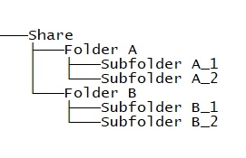
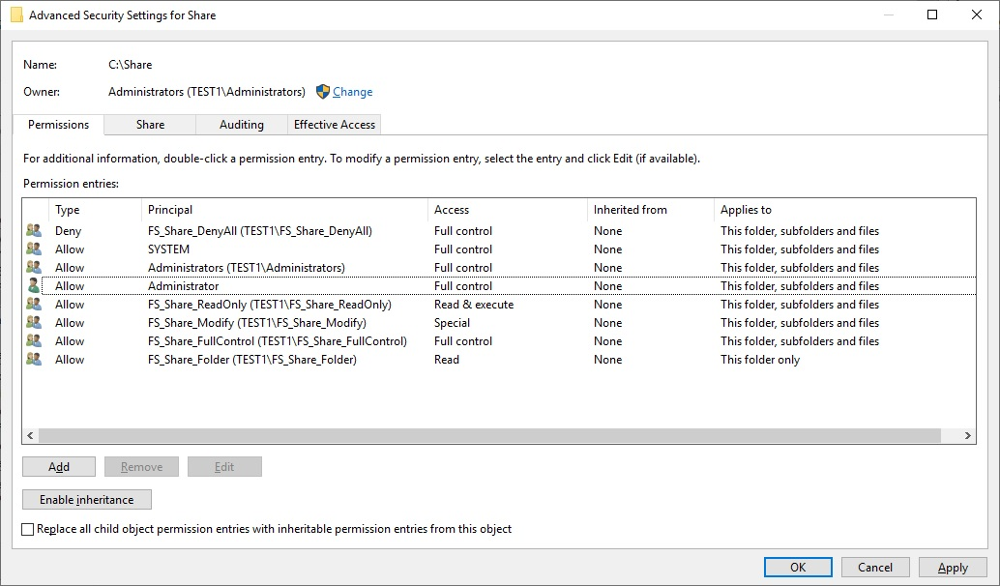
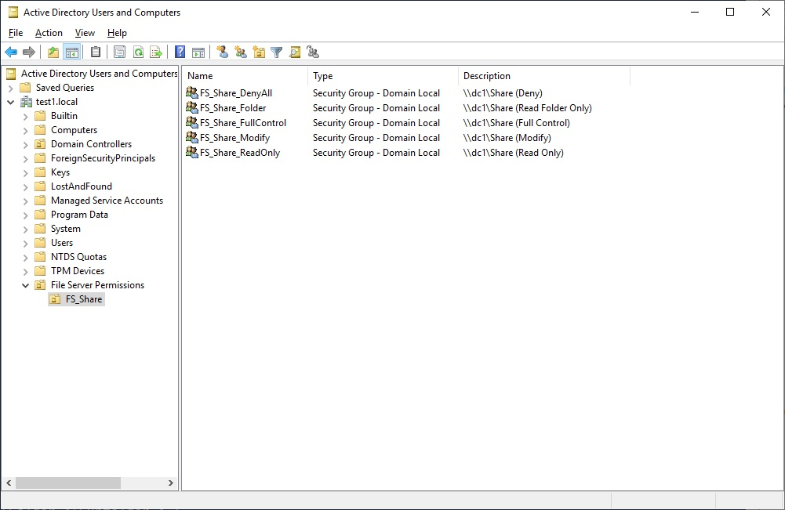
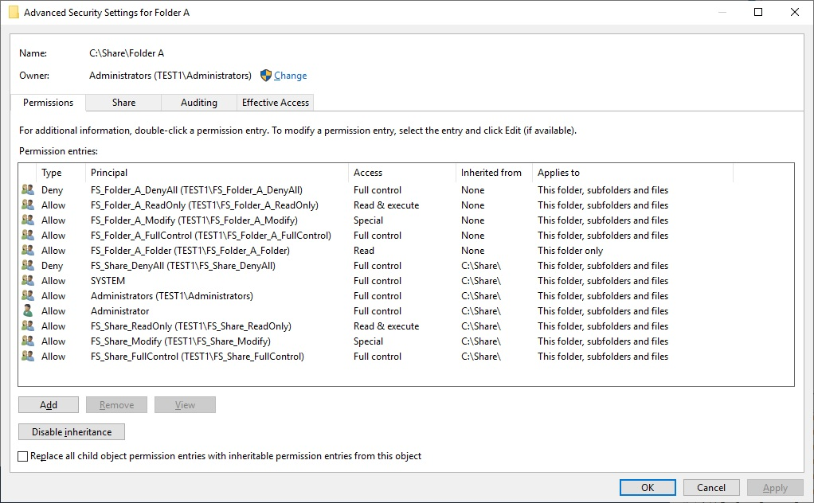
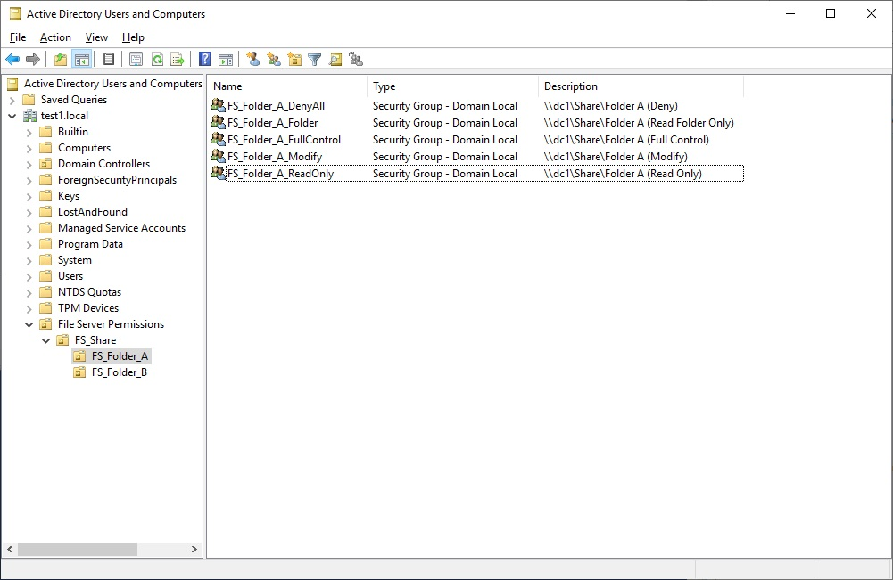

# File Server Permissions

Автоматизация настройки разрешений на общие папки файл сервера:
- создаются группы и OU Active Directory 
- добавляется описание
- назначаются права на папки  
  
Необходимо создать корневую папку и открыть общий доступ для *Everyone* на запись. В дополнительных настройках безопасности *Everyone* нужно будет удалить. После чего поочередно запустить два скрипта.  
**Folder.ps1** назначает права на корневую папку.  
**Subfolder.ps1** - на все вложенные в нее папки.  
При необходимости назначения прав на следующий уровень структуры можно запустить **Subfolder.ps1** повторно.
  
## Folder.ps1  
> **$path** - UNC путь к общей папке  
> **$path1** - путь в ADUC, в котором будет создана OU с группами
  
В результате выполнения скрипта будут назначены разрешения на папку с помощью групп. 
  
**FullControl** - полный доступ с возможностью изменения разрешение  
**Modify** - права на запись и удаление подпапок без возможности удаления корневой папки и изменения разрешений  
**ReadOnly** - права на чтение  
**DenyaAll** - запрет доступа  
**Folder** - доступ на чтение только к папке. Необходим только для назначения права на вложенные папки
  
  

Будет создана новая OU, в которой будут находится группы. В описании указан путь к папке и назначенные разрешения

  

## Subfolder.ps1
> **$path** - UNC путь к корневой папке  
> **$path1** - путь в ADUC, в котором будет созданы OU с группами

В результате выполнения скрипта буду назначены разрешения на все вложенные в корневую папки. Права будут наследоваться с корневой. Таким образом можно назначить права на всю корневую папку целиком, либо только на конкретную подпапку. При необходимости открыть доступ на всю папку на 1 уровне за исключением одной папки на 2 уровне, можно добавить пользователя в группу DenyAll папки уровня 2.  

  
  
Будет создана отдельная OU на каждую подпапку. Таким образом, для удобства поиска необходимой группы, структура OU будет повторять структуру вложенности папок.
  
  

